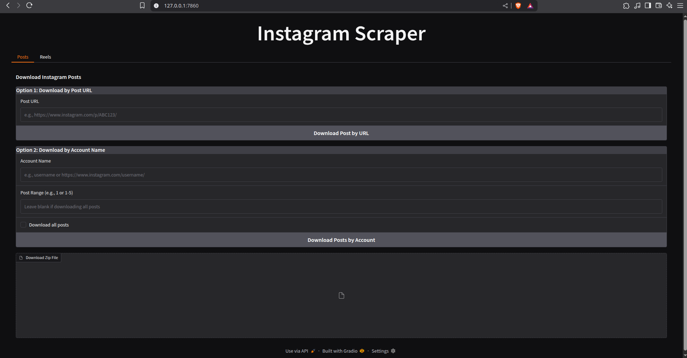

# Instagram Scraper
A Python tool to scrape Instagram posts and reels, either by URL or account name, using gallery-dl. The tool saves media files, CSV metadata, and JSON metadata in an organized directory structure. It includes a Gradio-based web interface for user-friendly interaction.

[](https://github.com/anupam1307/Insta-scraper)
[](https://github.com/anupam1307/Insta-scraper/commits)
[](https://github.com/mikf/gallery-dl)
[](https://gradio.app/)
[](https://)




## Features
* Scrape by URL: Download individual Instagram posts or reels using their URLs.
* Scrape by Account: Download posts or reels from a specified Instagram account, with options to select a range or all items.
* Metadata Extraction: Save metadata (e.g., username, caption, likes, comments) in CSV and JSON formats.
* Gradio Interface: Interactive web UI to input URLs or account names and download results as a zip file.
* Duplicate Handling: Prevents re-downloading of already processed media and removes duplicate .mp4 files from posts if present in reels.
* Error Handling: Retries failed downloads and provides detailed logs.

## Requirements

* Python 3.8+
* Required Python packages:
    * gallery-dl
    * pandas
    * tqdm
    * gradio

* A valid gallery-dl.conf configuration file (required for authentication and settings).
* Internet connection for accessing Instagram.

## Installation

1. Clone the repository:
```bash 
git clone git github.com:anupam1307/Insta-scraper.git
cd Insta_scraper
```


2. Install dependencies:
```bash
pip install gallery-dl pandas tqdm gradio
```


3. Configure gallery-dl:
* Create a gallery-dl.conf file in the project directory.
* Add your Instagram credentials or session cookies as per gallery-dl documentation.
* Example configuration:
``` 
{
    "extractor":{
        "instagram":{
            "cookies": "instagram_cookies.txt,
            "api": "rest",
            "include": "post,stories,reel,highlights",
        }
    }
}
```


Usage
Command-Line Usage (instagram_scraper.py)
Run the script directly to scrape media:

Scrape a single post or reel by URL:
python instagram_scraper.py

Example in code:
from instagram_scraper import scrape_instagram
scrape_instagram(input_data="https://www.instagram.com/reel/DIuxxtjPcnE/", is_url=True)


Scrape posts/reels by account name:

For a specific range (e.g., posts 1 to 3):scrape_instagram(search="dhwanit.vsit", is_url=False, post_range="1-3")


For all posts/reels:scrape_instagram(search="dhwanit.vsit", is_url=False, all_posts=True)


Gradio Interface (instagram_gradio.py)
Launch the web interface:
python instagram_gradio.py


Access the interface in your browser (URL provided in the terminal, typically http://127.0.0.1:7860).
Posts Tab:
By URL: Enter a post URL (e.g., https://www.instagram.com/p/ABC123/) and click "Download Post by URL".
By Account: Enter an account name (e.g., username or https://www.instagram.com/username/), specify a range (e.g., 1-5) or check "Download all posts", and click "Download Posts by Account".


Reels Tab: Similar to Posts, but for reel URLs (e.g., https://www.instagram.com/reel/DEF456/) or account reels.
Output: A zip file containing the scraped media, CSV metadata, and JSON metadata is provided for download.

Output Directory Structure
The scraper organizes files in a directory named date=DD-MM-YYYY (or a custom base_path). Example structure:
date=15-05-2025/
├── Instagram Post/
│   ├── <account_name>/
│   │   ├── <media_id>/
│   │   │   ├── <media_files>.jpg/png/webp
├── Instagram Eliots/
│   ├── <media_id>/
│   │   ├── <media_files>.jpg/png/webp/mp4
├── Instagram Reel/
│   ├── <account_name>/
│   │   ├── <media_id>/
```bash
│   │   ├── <media_files>.mp4
├── CSV_Posts/
│   ├── metadata.csv
├── CSV_Reels/
│   ├── metadata.csv
├── Metadata_Post/
│   ├── metadata.json
├── Metadata_Reels/
│   ├── metadata.json
├── media_ids.csv


Media Files: Images (.jpg, .png, .webp) for posts, videos (.mp4) for reels.
CSV Files: Contain metadata like media ID, username, timestamp, caption, likes, comments, and URL.
JSON Files: Contain raw metadata from Instagram.
media_ids.csv: Tracks downloaded media IDs to avoid duplicates.

Notes

Private Accounts: Scraping private accounts requires valid gallery-dl credentials in gallery-dl.conf.
Rate Limiting: The script includes delays to avoid Instagram rate limits. Adjust time.sleep(2) in instagram_scraper.py if needed.
Duplicate .mp4 Files: The script removes .mp4 files from the Instagram Post directory if they are also present in Instagram Reel.
Temporary Files: The Gradio interface creates temporary directories (scrape_<uuid>) during scraping, which are deleted after zipping.
Error Handling: The script retries failed downloads up to 3 times with a 5-second delay.
Gradio Output: The zip file contains only the current scrape’s data. Previous scrapes are not included.

Limitations

Dependent on gallery-dl functionality and Instagram’s API stability.
May fail for private accounts without proper authentication.
Large account scraping (e.g., thousands of posts) may hit rate limits or timeouts.
Video posts in the Instagram Post directory may be removed if identical to reels.

Troubleshooting

gallery-dl not installed: Run pip install gallery-dl.
No media downloaded: Check gallery-dl.conf for valid credentials and ensure the account/post is public.
Timeout errors: Increase the timeout in instagram_scraper.py (e.g., timeout=600) or add longer delays.
Invalid post_range: Ensure the range is in the format 1 or 1-5 and within available posts/reels.

License
This project is licensed under the MIT License. See the LICENSE file for details.
Contributing
Contributions are welcome! Please submit a pull request or open an issue on the repository.
Acknowledgments

gallery-dl for the core scraping functionality.
Gradio for the web interface.

